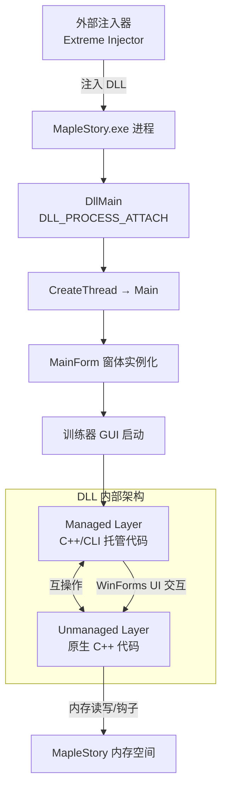
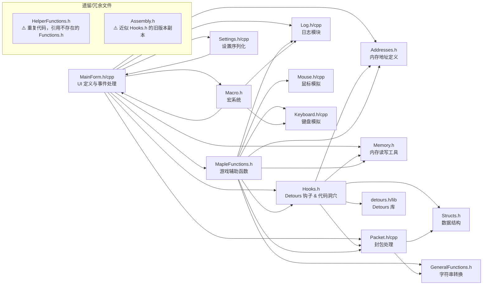
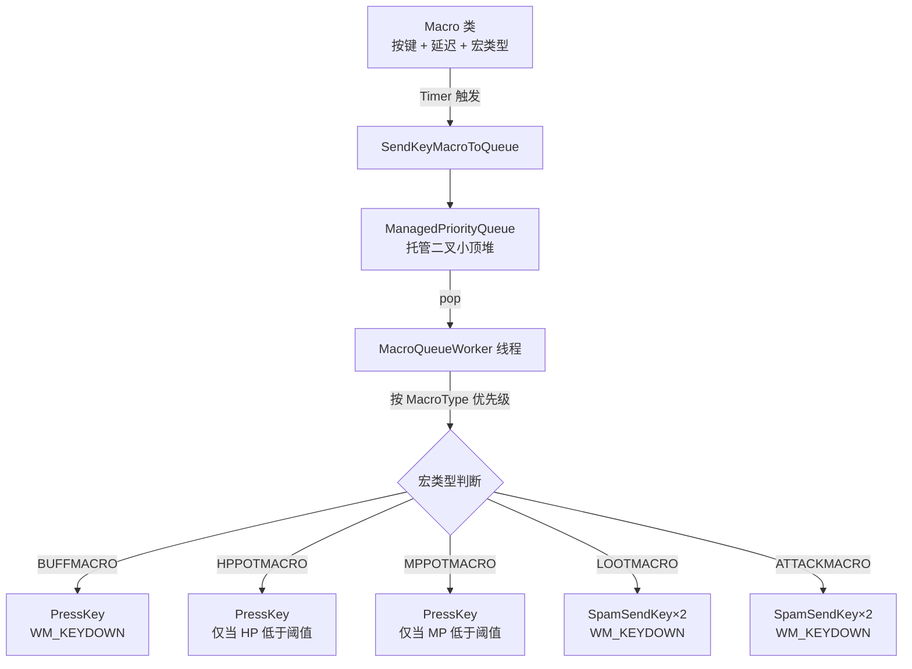

# 架构说明

## 整体架构

Timelapse 是一个 **C++/CLI 混合模式 DLL**，通过外部注入器注入到 MapleStory v83 客户端进程中。注入后，DLL 的 `DllMain` 入口点在 `DLL_PROCESS_ATTACH` 时创建一个独立线程运行 `Main()` 函数，进而创建 WinForms 主窗体。



## 托管/非托管边界

代码库大量混合了原生 C++ 与 C++/CLI，关键边界通过 `#pragma managed` / `#pragma unmanaged` 标记：

| 区域 | 类型 | 说明 |
|------|------|------|
| `CodeCave` 宏内的汇编代码洞穴 | **非托管** | 包含 `__asm` 内联汇编，直接操作游戏内存 |
| `ReadMultiPointer*` 系列函数 | **非托管** | 低级内存指针操作 |
| WinForms UI 及事件处理 | **托管** | C++/CLI 管理的 WinForms 控件和事件 |
| 宏系统（`Macro` 类等） | **托管** | 使用 `System::Threading::Timer` 和托管优先级队列 |
| 指针显示函数（`PointerFuncs` 命名空间） | **托管** | 读取并格式化游戏数据供 UI 显示 |

## DLL 加载与入口点

```cpp
// MainForm.cpp
BOOL APIENTRY DllMain(HMODULE hDLL, DWORD reason, LPVOID reserved) {
    if (reason == DLL_PROCESS_ATTACH) {
        GlobalVars::hDLL = hDLL;
        DisableThreadLibraryCalls(hDLL);
        CreateThread(NULL, NULL, (LPTHREAD_START_ROUTINE)&Main, NULL, NULL, NULL);
    }
    return TRUE;
}

void Main() {
    Application::EnableVisualStyles();
    Application::SetCompatibleTextRenderingDefault(false);
    Application::Run(gcnew MainForm());
}
```

## 全局状态管理

项目使用两组全局变量分别在托管和非托管代码中共享状态：

### 非托管全局变量（`GlobalVars` 命名空间，`Hooks.h` 内定义）
```cpp
namespace GlobalVars {
    static HMODULE hDLL;           // 当前 DLL 模块句柄
    static HWND mapleWindow = nullptr;  // MapleStory 窗口句柄
}
```

### 托管全局状态（`Assembly` 命名空间，`Hooks.h` 内定义）
```cpp
namespace Assembly {
    // 钩子捕获的游戏数据
    ULONG curHP = 0, maxHP = 0, curMP = 0, maxMP = 0, curEXP = 0, maxEXP = 0;
    ULONG mapNameAddr = 0x0;
    // 过滤器列表
    static std::vector<ULONG> *itemList = new std::vector<ULONG>();
    static std::vector<ULONG> *mobList = new std::vector<ULONG>();
    // 出生点控制数据
    static std::vector<SpawnControlData*> *spawnControl = new std::vector<SpawnControlData*>();
    // ... 更多
}
```

### 单例窗体访问
```cpp
// MainForm.h
static MainForm^ TheInstance;  // 任意位置均可通过此静态成员访问窗体
```

## 模块依赖关系



## 内存操作架构

### 指针读取链

游戏数据通过多层指针解引用获取。静态基址定义在 `Addresses.h` 中：

```
静态基址 → 一级指针 → 偏移 → 目标数据
```

例如读取角色 HP：
```
UIInfoBase (0xBEC208) → [UIInfoBase] + OFS_HP (0xD18) → HP 值
```

### ZtlSecureFuse 编码

部分游戏数据使用 Nexon 的 ZtlSecureFuse 编码（简单的相邻字节 XOR），`Memory.h` 提供了专用的读写函数：

```cpp
// 读取：先读取两个相邻字节，XOR 后得到实际值
static UINT8 readCharValueZtlSecureFuse(int at);
static INT16 readShortValueZtlSecureFuse(int a1);
inline unsigned int readLongValueZtlSecureFuse(ULONG *a1);

// 写入：读取当前相邻字节，计算 XOR 写入
static bool writeCharValueZtlSecureFuse(int at, UINT8 value);
static bool writeShortValueZtlSecureFuse(int a1, INT16 value);
inline bool writeLongValueZtlSecureFuse(ULONG *a1, unsigned int value);
```

### 多层指针读取

`ReadMultiPointerSigned` 和 `ReadMultiPointerString` 使用可变参数实现多层指针解引用：

```cpp
// 示例：读取两层指针 UserLocalBase → OFS_pID → OFS_Foothold
ReadMultiPointerSigned(UserLocalBase, 2, OFS_pID, OFS_Foothold)
```

## 钩子系统架构

### Microsoft Detours

使用 `SetHook()` 函数包装 Microsoft Detours API 来钩取游戏函数：

```cpp
bool SetHook(bool enable, void** function, void* redirection) {
    DetourTransactionBegin();
    DetourUpdateThread(GetCurrentThread());
    enable ? DetourAttach(function, redirection) : DetourDetach(function, redirection);
    DetourTransactionCommit();
}
```

### 代码洞穴 (Code Cave)

`CodeCave` 宏定义 `__declspec(naked)` 函数，内含内联汇编，用于拦截游戏函数执行流：

```cpp
#define CodeCave(name) static void __declspec(naked) ##name() { _asm
#define EndCodeCave }
```

代码洞穴的工作流程：
1. **拦截**：在目标地址处写入 `JMP` 指令跳转到代码洞穴
2. **处理**：在代码洞穴中读取/修改游戏数据
3. **返回**：跳转回原函数的后续指令

### 已实现的代码洞穴

| 代码洞穴名称 | 拦截的游戏函数 | 用途 |
|--------------|----------------|------|
| `StatHook` | `CUIStatusBar::SetNumberValue` | 捕获 HP/MP/EXP 数值 |
| `MapNameHook` | `CItemInfo::GetMapString` | 捕获当前地图名称 |
| `ItemVacHook` | `CDropPool::TryPickUpDrop` | 重定向物品拾取坐标 |
| `MouseFlyXHook` / `MouseFlyYHook` | `CVecCtrl::raw__GetSnapshot` | 鼠标飞行传送 |
| `ClickTeleportXHook` / `ClickTeleportYHook` | 同上 | 点击传送 |
| `MouseTeleportXHook` / `MouseTeleportYHook` | 同上 | 鼠标移动传送 |
| `MobFreezeHook` | `CVecCtrlMob::WorkUpdateActive` | 冻结怪物 |
| `MobAutoAggroHook` | 同上 | 怪物自动仇恨 |
| `SpawnPointHook` | `CVecCtrl::SetActive` | 出生点控制 |
| `ItemFilterHook` | `CDropPool::OnDropEnterField` | 物品过滤 |
| `MobFilter1Hook` / `MobFilter2Hook` | `CMobPool::SetLocalMob` / `OnMobEnterField` | 怪物过滤 |
| `MissGodmodeHook` | `CUserLocal::SetDamaged` | 闪避上帝模式 |
| `DupeXHook` | — | DupeEx 吸附 |
| `SendPacketLogHook` | 封包发送 | 封包记录 |

## Hack 开关机制

每个 Hack 功能都是复选框事件处理程序，通过 `WriteMemory()` 或 `Jump()` 修改硬编码地址处的字节：

- **简单字节补丁**：使用 `WriteMemory()` 写入 NOP (`0x90`)、JMP/JNE 翻转等
- **代码洞穴钩子**：使用 `Jump()` 在目标地址写入 `0xE9`（JMP 操作码）并计算相对跳转偏移

开关状态切换时，原始字节被硬编码为"关闭"状态，确保可以恢复原始代码。

## 宏系统架构



### 优先级队列

`ManagedPriorityQueue<T>` 是自定义的托管二叉小顶堆，替代了不兼容 v143 的 `cliext::priority_queue`：

- 按 `MacroType` 枚举值排序：数值越大优先级越高
- Buff 宏 > HP药水 > MP药水 > 拾取 > 攻击

### 按键发送

宏系统通过 `PostMessage(WM_KEYDOWN)` 向 MapleStory 窗口发送按键消息。`createKeyData()` 函数构建符合 Windows 消息格式的 `lParam`，包含扫描码和重复计数等信息。

## 嵌入资源

物品 ID、怪物 ID 和地图数据以 TEXT 资源形式嵌入在 `Timelapse.rc` 中：

| 资源 ID | 名称 | 内容 |
|---------|------|------|
| `ItemsList` | 物品列表 | 格式：`itemID[itemName]`，每行一条 |
| `MobsList` | 怪物列表 | 格式：`mobID[mobName]`，每行一条 |
| `MapsList` | 地图列表 | 格式待定，用于 Map Rusher |

运行时通过 `FindResource` / `LoadResource` 加载，`Assembly` 命名空间中的 `findItemNameFromID` 和 `findMobNameFromID` 函数负责查找。
