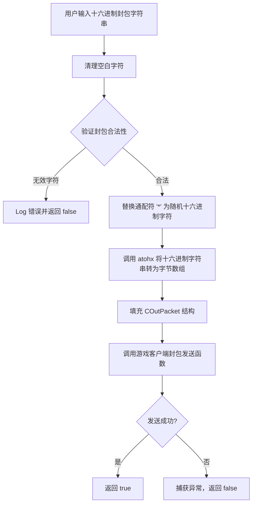

# 封包系统

本文档详细描述 Timelapse 的封包（Packet）系统，包括结构定义、发送/接收流程、封包构建器及日志记录。

---

## 1. 封包结构

### COutPacket — 发送封包结构

```cpp
struct COutPacket {
    int Loopback;                  // 是否为本地回环封包
    union {
        PUCHAR Data;               // 指向封包数据的完整缓冲区
        PVOID Unk;
        PUSHORT Header;            // 指向封包头（前 2 字节）
    };
    ULONG Size;                    // 封包数据总大小（字节数）
    UINT Offset;                   // 当前读写偏移位置
    int EncryptedByShanda;         // 是否使用 Shanda 加密
};
```

### CInPacket — 接收封包结构

```cpp
struct CInPacket {
    bool fLoopback;                // 是否为本地回环封包
    int iState;                    // 封包解析状态机当前状态
    union {
        PVOID lpvData;             // 指向封包数据的完整缓冲区
        struct { ULONG dw; USHORT wHeader; } *pHeader;  // 访问封包头
        struct { ULONG dw; PUCHAR Data; } *pData;       // 访问封包数据区
    };
    ULONG Size;                    // 封包数据总大小
    USHORT usRawSeq;               // 原始序列号
    USHORT usDataLen;              // 数据区长度
    USHORT usUnknown;              // 未知字段
    UINT uOffset;                  // 当前读写偏移位置
    PVOID lpv;                     // 内部缓冲区指针
};
```

---

## 2. 封包发送流程

### SendPacket 函数



**关键代码**：
```cpp
bool SendPacket(String^ packetStr) {
    COutPacket Packet;
    SecureZeroMemory(&Packet, sizeof(COutPacket));

    // 1. 清理空白字符
    String^ rawPacket = packetStr->Replace(" ", String::Empty);

    // 2. 验证合法性
    if (!IsValidRawPacket(rawPacket)) return false;

    // 3. 替换通配符
    String^ processedPacket = rawPacket->Replace("*", (rand() % 16).ToString("X"));

    // 4. 十六进制字符串 → 字节数组
    BYTE tmpPacketBuf[150];
    const LPCSTR lpcszPacket = static_cast<LPCSTR>(
        Runtime::InteropServices::Marshal::StringToHGlobalAnsi(processedPacket).ToPointer());
    Packet.Size = strlen(lpcszPacket) / 2;
    Packet.Data = atohx(tmpPacketBuf, lpcszPacket);

    // 5. 通过客户端钩子发送
    try {
        Send(*ClientSocket, &Packet);
        return true;
    }
    catch (...) { return false; }
}
```

---

## 3. 封包接收流程

### RecvPacket 函数

逻辑与 `SendPacket` 类似，区别在于：
1. 填充的是 `CInPacket` 结构而非 `COutPacket`
2. 调用的是游戏客户端的封包接收函数 `Recv`
3. 替换通配符 `'``*'` 时直接使用 `rand()`，无二次验证

```cpp
bool RecvPacket(String^ packetStr) {
    CInPacket Packet;
    SecureZeroMemory(&Packet, sizeof(CInPacket));
    // ... 类似 SendPacket 的处理 ...
    Packet.lpvData = atohx(tmpPacketStr, lpcszPacket);
    try {
        Recv(*ClientSocket, &Packet);
        return true;
    }
    catch (...) { return false; }
}
```

---

## 4. 封包构建器

辅助函数用于将基本数据类型编码为十六进制字符串，写入封包流中：

| 函数 | 编码方式 | 用途 |
|------|---------|------|
| `writeByte(packet, byte)` | 2 位十六进制 | 写入单字节 |
| `writeBytes(packet, bytes[])` | 逐字节 2 位十六进制 | 写入字节数组 |
| `writeString(packet, str)` | 长度前缀 + 空字节 + UTF8 内容 | 写入字符串 |
| `writeInt(packet, num)` | 小端序 4 字节 | 写入 32 位整数 |
| `writeShort(packet, num)` | 小端序 2 字节 | 写入 16 位短整数 |
| `writeUnsignedShort(packet, num)` | 小端序 2 字节 | 写入 16 位无符号短整数 |

### writeString 详解

字符串编码格式：
```
[长度低字节] [长度高字节] [0x00] [UTF8字节1] [UTF8字节2] ... [UTF8字节N]
```

**示例**：编码字符串 "Hi"（2 字节 UTF8）
```
02 00 00 48 69
│  │  │  │  └─ 'i' (0x69)
│  │  │  └─ 'H' (0x48)
│  │  └─ 空字节 (0x00)
│  └─ 长度高字节 (0x00)
└─ 长度低字节 (0x02)
```

---

## 5. 封包合法性验证

`IsValidRawPacket` 函数检查封包字符串是否合法：

```cpp
bool IsValidRawPacket(String^ rawPacket) {
    if (String::IsNullOrEmpty(rawPacket)) {
        Log::WriteLineToConsole("SendPacket::ERROR: Packet is Empty!");
        return false;
    }
    // 仅允许 0-9, A-F, *
    for (int i = 0; i < rawPacket->Length; i++) {
        if (rawPacket[i] >= '0' && rawPacket[i] <= '9') continue;
        if (rawPacket[i] >= 'A' && rawPacket[i] <= 'F') continue;
        if (rawPacket[i] == '*') continue;  // 通配符
        Log::WriteLineToConsole("SendPacket::ERROR: Invalid character: \""
            + rawPacket[i] + "\"");
        return false;
    }
    return true;
}
```

**允许的字符**：`0-9`、`A-F`（大写）、`*`（通配符，运行时替换为随机十六进制数字）

---

## 6. 封包日志

### SendPacketLogHook
通过钩取客户端封包发送函数，记录所有发出的封包到 `sendPacketLogQueue`：

```cpp
// 钩子触发时将封包数据加入队列
sendPacketLogQueue->push(formattedPacketData);

// UI 线程从队列中取出并显示
while (!sendPacketLogQueue->empty()) {
    auto packet = sendPacketLogQueue->top();
    sendPacketLogQueue->pop();
    // 添加到 ListView 控件
}
```

### 待实现功能
| 功能 | 状态 | 说明 |
|------|------|------|
| 封锁所有封包 | ❌ 缺失 | 阻止所有封包的发送/接收 |
| 记录发送封包 | ❌ 缺失 | 将发送的封包记录到日志 |
| 记录接收封包 | ❌ 缺失 | 将接收的封包记录到日志 |
| 多封包发送 | ❌ 缺失 | 支持一次发送多个封包 |
| 查找/编码定义封包 | ❌ 缺失 | 查找已知封包格式或自定义封包编码 |
| Auto AP 封包 | ❌ 缺失 | 自动分配能力点的封包 |
| Auto-Sell 封包 | ❌ 缺失 | 自动出售物品的封包 |
| 跨大陆封包 | ❌ 缺失 | 跨大陆传送的封包 |

---

## 7. 封包地址

| 地址 | 说明 |
|------|------|
| `0x00BE7914` | 客户端 Socket 指针 (`clientSocketAddr`) |
| `0x0049637B` | 发送封包函数 (`COutPacketAddr`) |
| `0x004965F1` | 接收封包函数 (`CInPacketAddr`) |

封包的发送和接收通过以下类型转换实现：
```cpp
PVOID* ClientSocket = reinterpret_cast<PVOID*>(clientSocketAddr);
typedef void(__thiscall *PacketSend)(PVOID clientSocket, COutPacket* packet);
PacketSend Send = reinterpret_cast<PacketSend>(COutPacketAddr);
typedef void(__thiscall *PacketRecv)(PVOID clientSocket, CInPacket* packet);
PacketRecv Recv = reinterpret_cast<PacketRecv>(CInPacketAddr);
```

---

## 8. 安全注意事项

- **封包操作有封号风险**：服务器端的异常封包检测可能导致账号被封禁
- **通配符 `*`**：每次发送时会生成随机值，适合需要随机化的场景
- **线程安全**：当前 `SendPacket` 和 `RecvPacket` 缺乏线程安全保护（标记为 TODO）
- **封包大小限制**：缓冲区大小为 150 字节（`tmpPacketBuf[150]`），超大封包会溢出
